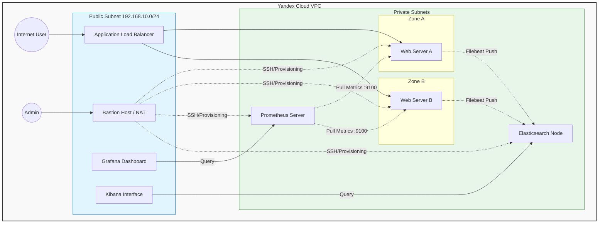

### Курсовая работа на профессии "DevOps-инженер с нуля"

## Архитектура решения

Инфраструктура организована в виде VPC с разделением на публичные и приватные подсети. Весь внешний трафик проходит через Application Load Balancer.



## Развертывание

1. Инфраструктура (Terraform)


```bash
cd terraform

# Инициализация
terraform init

# Применение конфигурации
terraform apply -auto-approve

# Сохранение outputs
terraform output > ../terraform-outputs.txt
```

2. Настройка серверов (Ansible)
   
```bash
cd ansible

# Обновление inventory из Terraform outputs
ansible-playbook generate_inventory.yml

# Настройка web-серверов
ansible-playbook -i inventories/hosts.yml playbooks/site.yml

# Настройка мониторинга
ansible-playbook -i inventories/hosts.yml playbooks/monitoring.yml

# Настройка логирования
ansible-playbook -i inventories/hosts.yml playbooks/logging.yml
```
## Доступ к сервисам

| Сервис | URL | Логин/Пароль | Описание |
| :--- | :--- | :--- | :--- |
| **Сайт** | [http://158.160.217.90](http://158.160.217.90) | - | Балансировка между web-a и web-b |
| **Grafana** | [http://178.154.200.203:3000](http://178.154.200.203:3000) | admin/admin | Визуализация метрик |
| **Kibana** | [http://89.169.130.108:5601](http://89.169.130.108:5601) | - | Анализ логов |
| **Prometheus** | [http://192.168.20.30:9090](http://192.168.20.30:9090) <br> *(через bastion)* | - | Сбор метрик |
