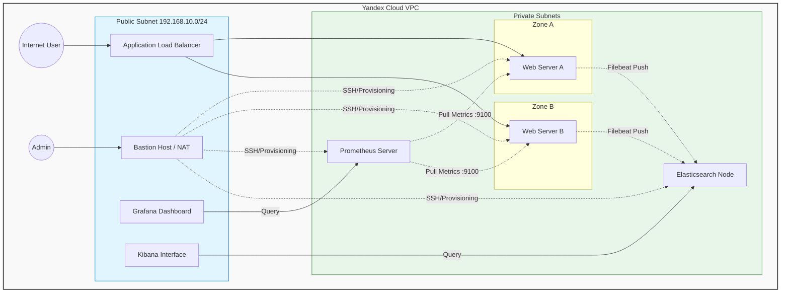
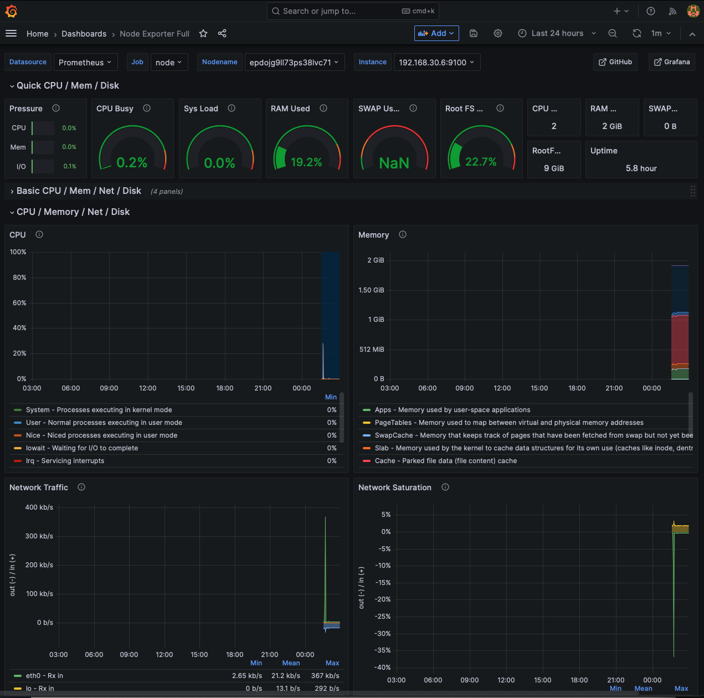
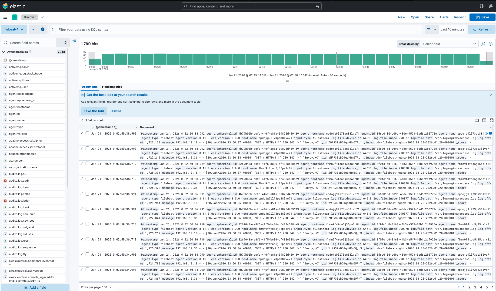
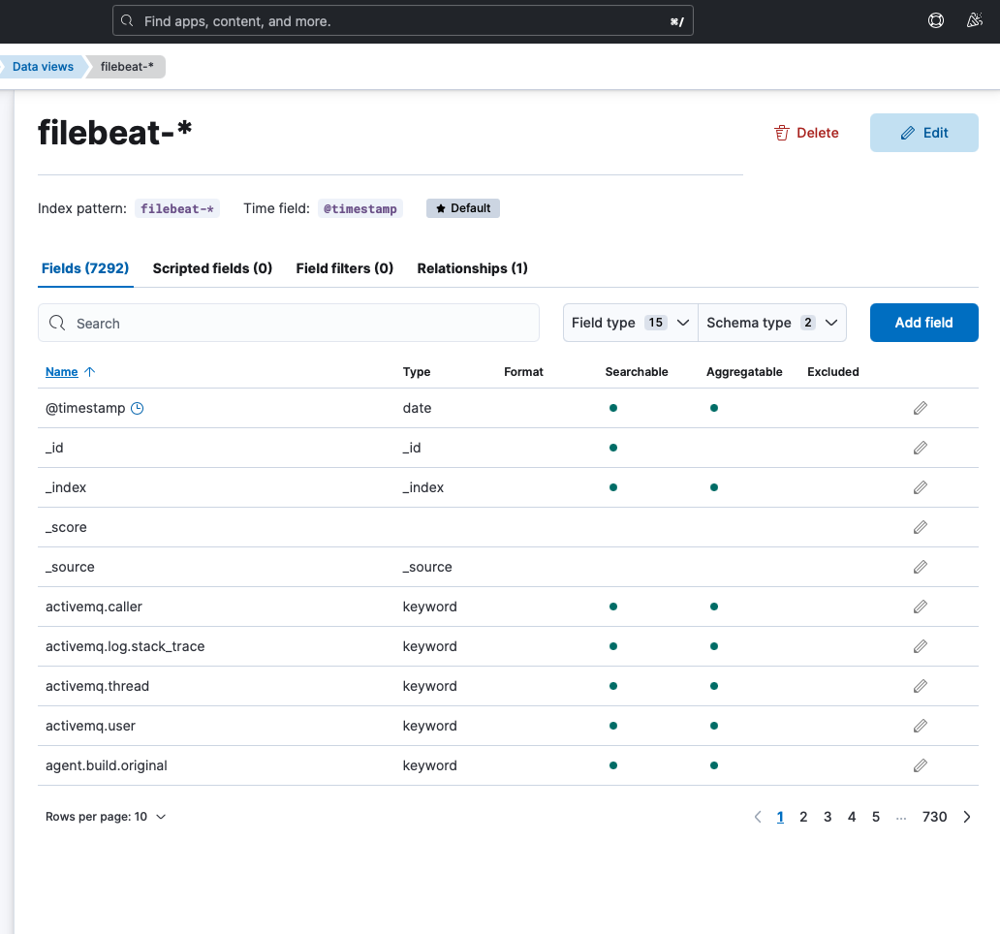
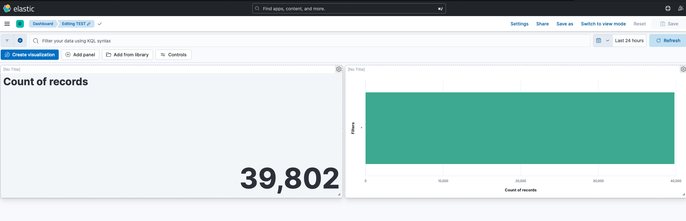
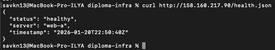

### Курсовая работа на профессии "DevOps-инженер с нуля"

## Архитектура решения

Инфраструктура организована в виде VPC с разделением на публичные и приватные подсети. Весь внешний трафик проходит через Application Load Balancer.



## Развертывание

1. Инфраструктура (Terraform)


```bash
cd terraform

# Инициализация
terraform init

# Применение конфигурации
terraform apply -auto-approve

# Сохранение outputs
terraform output > ../terraform-outputs.txt
```

2. Настройка серверов (Ansible)
   
```bash
cd ansible

# Обновление inventory из Terraform outputs
ansible-playbook generate_inventory.yml

# Настройка web-серверов
ansible-playbook -i inventories/hosts.yml playbooks/site.yml

# Настройка мониторинга
ansible-playbook -i inventories/hosts.yml playbooks/monitoring.yml

# Настройка логирования
ansible-playbook -i inventories/hosts.yml playbooks/logging.yml
```
## Доступ к сервисам

| Сервис | URL | Логин/Пароль | Описание |
| :--- | :--- | :--- | :--- |
| **Сайт** | [http://158.160.217.90](http://158.160.217.90) | - | Балансировка между web-a и web-b |
| **Grafana** | [http://178.154.200.203:3000](http://178.154.200.203:3000) | admin/admin | Визуализация метрик |
| **Kibana** | [http://89.169.130.108:5601](http://89.169.130.108:5601) | - | Анализ логов |
| **Prometheus** | [http://192.168.20.30:9090](http://192.168.20.30:9090) <br> *(через bastion)* | - | Сбор метрик |


## Скрины

1. Grafana - Node Exporter Full Dashboard


 

2. Kibana - Просмотр логов nginx




3. Kibana - Визуализация данных

   


4. Elastic

   



5.Health Check Endpoint



## Собираемые метрики

- CPU Utilization, Saturation, Errors
- Memory Utilization, Saturation
- Disk I/O, Utilization
- Network throughput and errors
- HTTP response count and size

## Выводы и особенности реализации

В ходе выполнения курсового проекта были выявлены и проработаны несколько
важных инфраструктурных нюансов, характерных для реальных production-сред
и облачных платформ.

### NAT и доступ в интернет из приватной сети

Все сервисы (web, monitoring, logging) размещены в **приватных подсетях**
без прямого доступа в интернет. Для выхода во внешний мир используется
**NAT Instance**, что соответствует best practices по безопасности.

Однако в процессе реализации возникли следующие особенности:

- **Публичный IP NAT-инстанса назначается только после создания инфраструктуры**
- На этапе `terraform apply` этот IP ещё недоступен
- Из-за этого невозможно напрямую использовать его в `route_table`
  без дополнительных ухищрений

При попытке описать маршруты через `self-reference` возникал
**циклический dependency graph**, который Terraform не смог разрешить.

В результате:
- маршрутизация была реализована через **явное указание `route_table_id`**
- часть логики была вынесена в отдельный шаг
- решение является **рабочим**, но требует рефакторинга при дальнейшем развитии

### Итоговое наблюдение

Проект показал, что:
- даже при использовании IaC остаются **границы между декларативным описанием и реальной инфраструктурой**
- сетевые зависимости и порядок создания ресурсов критичны
- не все проблемы решаются «чистой конфигурацией», иногда требуются инженерные компромиссы

Полученный опыт напрямую применим в реальных проектах и даёт
понимание того, **где Terraform и Ansible заканчиваются, а архитектурное мышление начинается**.

## Post Scriptum

Инфраструктура проекта на данный момент **оставлена активной** для проверки
и демонстрации работоспособности всех компонентов.

После завершения защиты курсового проекта 
инфраструктура будет **полностью удалена**, чтобы избежать дальнейших затрат
на облачные ресурсы.

Спасибо за понимание.
